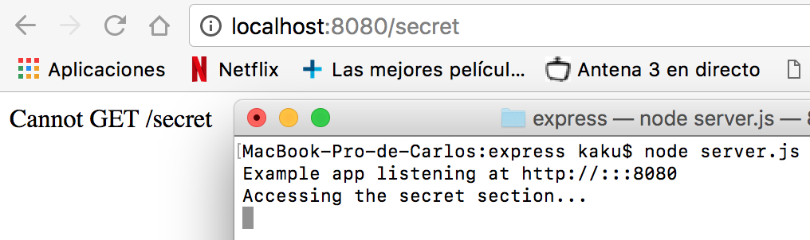

# EXPRESSS

## Routing basico

El routing se encarga de controlar como una aplicación responderá a una petición de un cliente.
Cada route tendra una o más respuestas y un path del server.

Cada route estará compuesto por una instancia de express, generalmente lo llamaremos *app*, un método http de respuesta, como put, post, get... y una o más funciones de respuesta.

Algunos ejemplos de routing pueden ser:
~~~
  app.post('/hello', function (req, res) {  
    res.send('Hello!!!')  
  })  

  app.get('/hello', function (req, res) {  
    res.send('Hello!!!')  
    })  
~~~

Tambien tenemos algún método no derivado de los metodos http, que nos permite cargar funciones middleware con métodos request, como el método all.

Por ejemplo:
~~~
app.all('/secret', function (req, res, next) {  
  console.log('Accessing the secret section...')  
  next()  
})  
~~~
En este caso, no tenemos definida una función para next, y tampoco hemos definido un contenido que mostrar por el servidor, pero si un mensaje que mostrar en la consola cuando es llamado '/secret'.

  

Si además le definimos una función next:
~~~
app.all('/secret', function (req, res, next) {  
  console.log('Accessing the secret section...')  
}, function (req, res) {  
  res.send('Secreto')  
})  
~~~
Podremos obtener ambas salidas. En caso

  