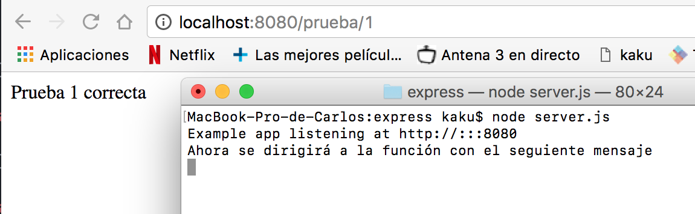
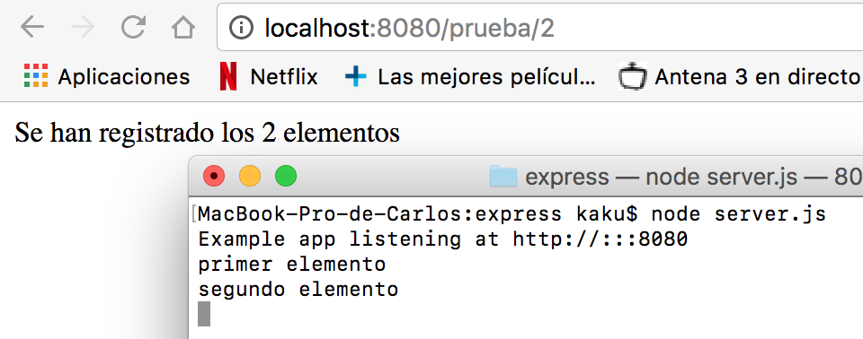

# EXPRESSS

## Routing basico

El routing se encarga de controlar como una aplicación responderá a una petición de un cliente.
Cada route tendra una o más respuestas y un path del server.

Cada route estará compuesto por una instancia de express, generalmente lo llamaremos *app*, un método http de respuesta, como put, post, get... y una o más funciones de respuesta.

Algunos ejemplos de routing pueden ser:
~~~
  app.post('/hello', function (req, res) {  
    res.send('Hello!!!')  
  })  

  app.get('/hello', function (req, res) {  
    res.send('Hello!!!')  
    })  
~~~

Tambien tenemos algún método no derivado de los metodos http, que nos permite cargar funciones middleware con métodos request, como el método all.

Por ejemplo:
~~~
app.all('/secret', function (req, res, next) {  
  console.log('Accessing the secret section...')  
  next()  
})  
~~~
En este caso, no tenemos definida una función para next, y tampoco hemos definido un contenido que mostrar por el servidor, pero si un mensaje que mostrar en la consola cuando es llamado '/secret'.

  

Si además le definimos una función next:
~~~
app.all('/secret', function (req, res, next) {  
  console.log('Accessing the secret section...')  
}, function (req, res) {  
  res.send('Secreto')  
})  
~~~
Podremos obtener ambas salidas. En caso

  
  

## Multiple Handler

Haciendo uso de los http request methods también podemos definir estructuras un poco más complejas, con varias funciones de respuesta.
Por ejemplo podemos utilizar una función next para definir dos salidas.
~~~
app.get('/prueba/1', function(req, res, next) {  
  console.log('Ahora se dirigirá a la función con el seguiente mensaje')  
  next()  
}, function (req, res) {  
  res.send('Prueba 1 correcta')  
})  
~~~

o haciendo uso de variables, definir más de 2 salidas.
~~~
var ejemplo1 = function (req, res, next) {  
  console.log('primer elemento')  
  next()  
}  

var ejemplo2 = function (req, res, next) {  
  console.log('segundo elemento')  
  next()  
}  

var ejemplo3 = function (req, res) {  
  res.send('Se han registrado los 2 elementos')  
}  

app.get('/prueba/2', [ejemplo1, ejemplo2, ejemplo3])
~~~
 

O como forma alternativa.
~~~
 app.get('/prueba/3', [ejemplo1, ejemplo2], function(req, res, next){  
   console.log('Añadido otro elemento')  
   next()  
 }, function(req, res) {  
   res.send('Se han registrado 3 elementos')  
 })  
~~~

## Route Path.

Para las route Path, podemos utilizar expresiones regulares, de forma que podemos definir más de una ruta para una misma función.
Por ejemplo:

Si queremos que al escribir cualquier cadena que empiece por 'a', responda Buenos Dias!!.
~~~
app.get('/a*', function (req, res) {  
  res.send('Buenos Días!!')  
})  
~~~

O si queremos que responda lo mismo para 'chico' y 'chica'.
~~~
app.get('/chic[oa]', function (req, res) {  
  res.send('Buenos Días!')  
})  
~~~

Otra forma de manipular la route path es usando parámetros, y 'req.param':

Ejemplos:
~~~
app.get('/nombre/:nombre/apellido/:apellido', function (req, res) {  
  res.send(req.params)  
})  
~~~

~~~
app.get('/t/:min-:max', function (req, res) {  
  res.send(req.params)  
})  
~~~

